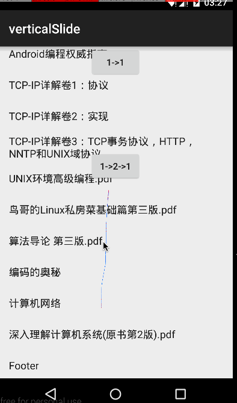

# 在 xmuSistone/android-vertical-slide-view 仁兄库下修改

主要是使两个FrameLayout里面可以放RecyclerView,在第一个FrameLayout中,如果RecyclerView滑动到了底部,再滑动放可拉出第二个界面.类似的,在第二个界面只有滑到顶部时,才会拉出第一个界面.

主要修改是更改ViewDragHelp与onInterceptTouchEvent之间的事件拦截逻辑.
具体可看源码.

# android-vertical-slide-view
vertical slide to switch to the next fragment page.

仿照淘宝和聚美优品，在商品详情页，向上拖动时，可以加载下一页。使用ViewDragHelper，滑动比较流畅。  
scrollView滑动到底部的时候，再行向上拖动时，添加了一些阻力。    
<td>
  
</td>
